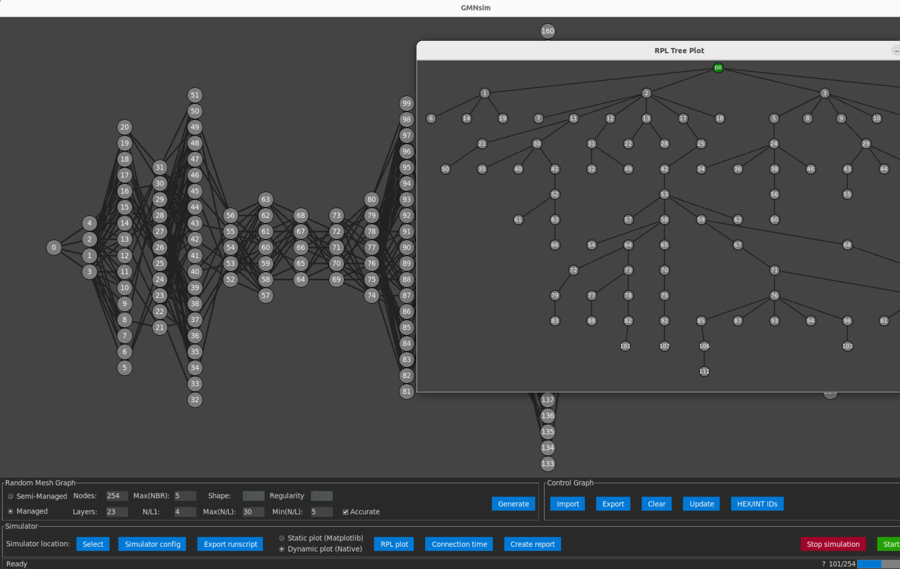

# Wi-SUN Simulator GUI

Wi-SUN Simulator GUI is a tool that provides a simple graphical interface for drawing and generating custom or random graphs. It is primarily designed to create graphs that can be used with a mesh network simulator based on the Mbed OS.

The GUI is capable of running and managing the simulation. There is also a live view of mesh network evolutions.

There are 2 modes to generate a graph. 



## Install

A few dependencies should be installed first:
```bash
sudo apt install libdbus-1-dev
sudo apt install libglib2.0-dev
sudo apt install graphviz graphviz-dev
sudo apt install build-essential
```
Create a python virtual environment and install dependencies via `pip` and `requirements.txt`

To run simulations, you need to get a copy of mbed simulator from https://github.com/mahboobkarimian/wisun-mbed-simulator.

## Live mesh view

You can monitor how nodes are connecting and mesh network develops. This fast video shows the mesh evolution continues after all nodes are connected.
<video src="all_connected.mp4" width="800"></video>

## Drawing nodes and edges

The process of creating a graph is straightforward.

* Draw nodes on the blank canvas by **clicking** on it.

* Connect two nodes, simply **right-click** on one node and then the other.

* Delete a node and its connected edges by pressing **Ctrl + Click**.

* Move a node and its edges by **double-click** and holding it.

* Click the "Update" button. If you have deleted some nodes or resized the window, this button will update your graph accordingly.

## Simulator

### Run manually by script

The "Simulator" panel enables you to configure the simulation and logging options. By clicking on the "Export Config" button, you can export these settings along with the graph to a bash script. The bash script can be directly executed to deploy nodes in the mesh network and start the simulation, **provided that it is copied beside the simulator executables, or the directory containing the simulation executables is selected in the app.**<br>
Example: `bash run_22_10_31_20_n51.sh`

### Run directly from the app

In the app, select the simulator path by selecting the directory containing the simulation executables.<br>
Then you can press "Start simulation" button. This will open a Terminal window where **it will ask your root password if you are not root user** to create a TUN interface.<br>
To avoid entering the root password, you can create a TUN interface in advance with the arbitrary IP that you want, and then uncheck the "Create TUN interface" box. Note that once you created a TUN interface, also you can uncheck this option.

## Export Graph

Click the 'Export Graph' button to write your graph into a text file with the format as `graph_%D_%H_%M_%S_#NODES.txt`

## Resources

This application is developed based on the code from the following open-source projects.

1. Random Graph generator adapted from [Random Directed Acyclic Graph Generator](https://github.com/Livioni/DAG_Generator)
2. Original GUI [graph_builder](https://github.com/ariel-weiss/graph_builder)